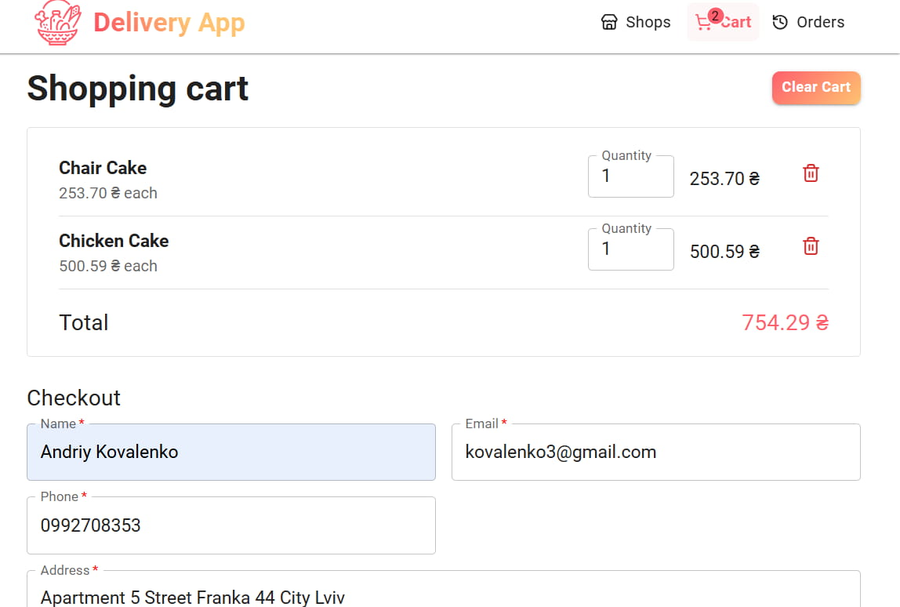
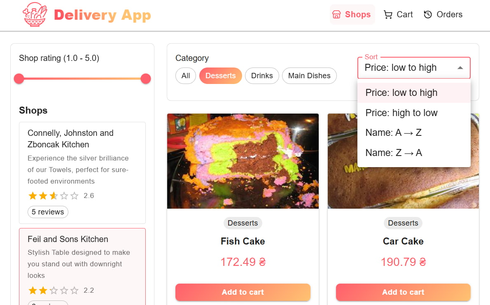
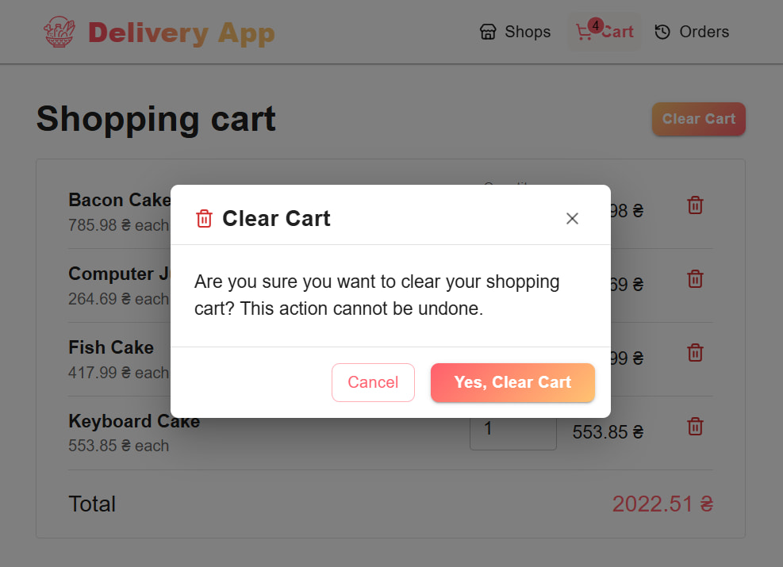
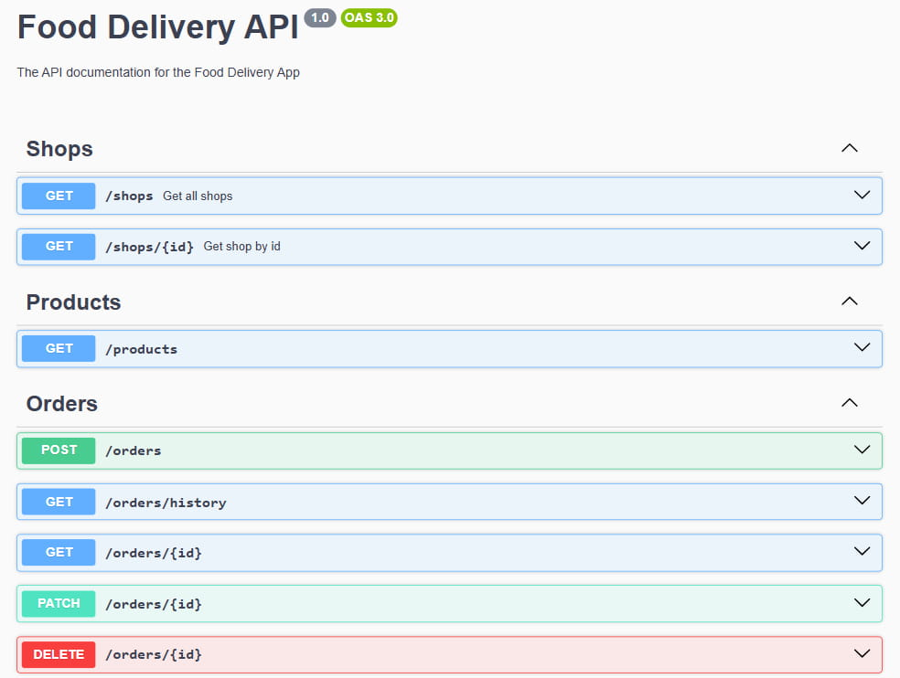
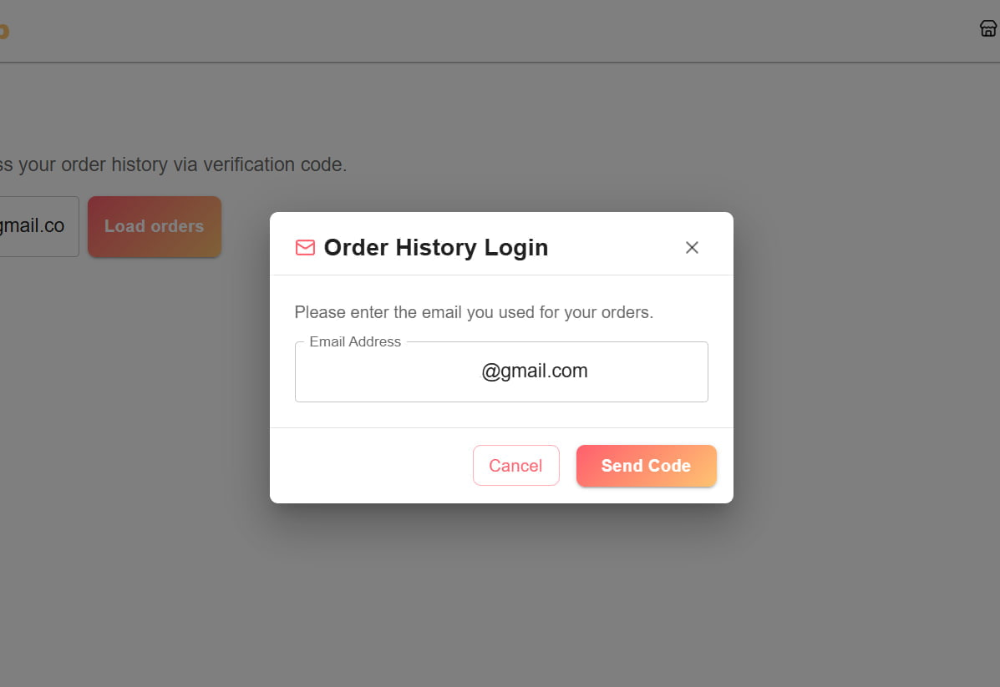
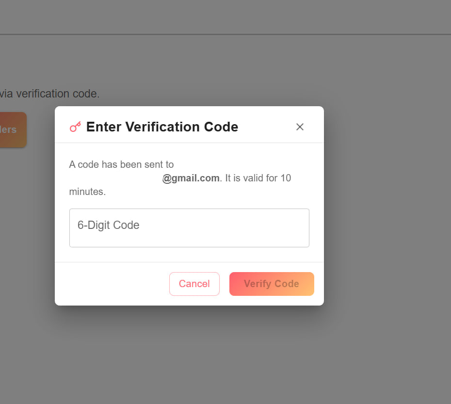
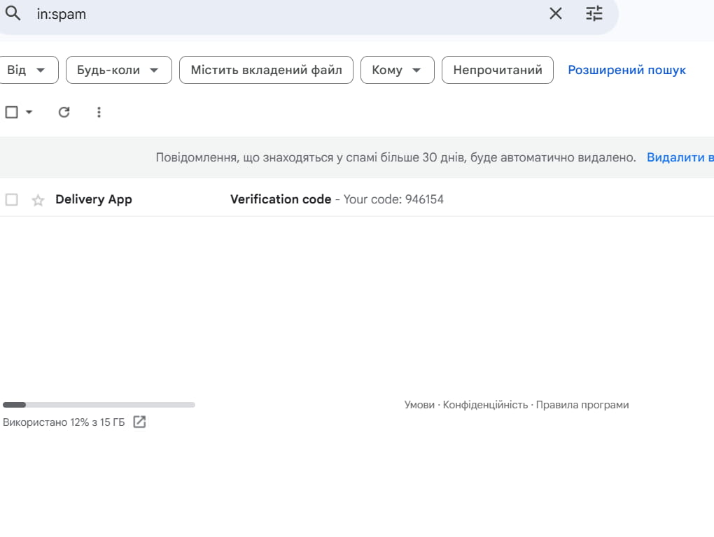
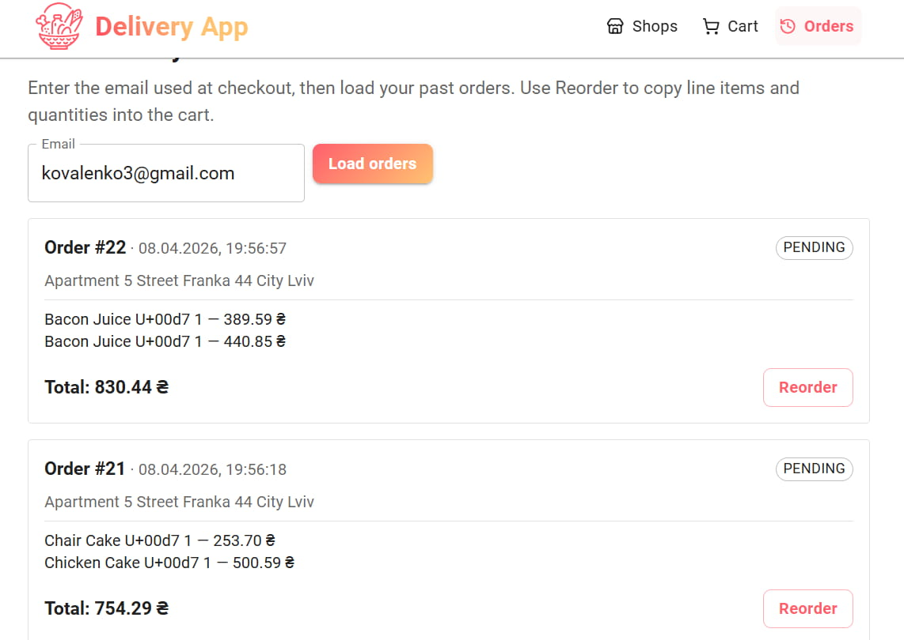
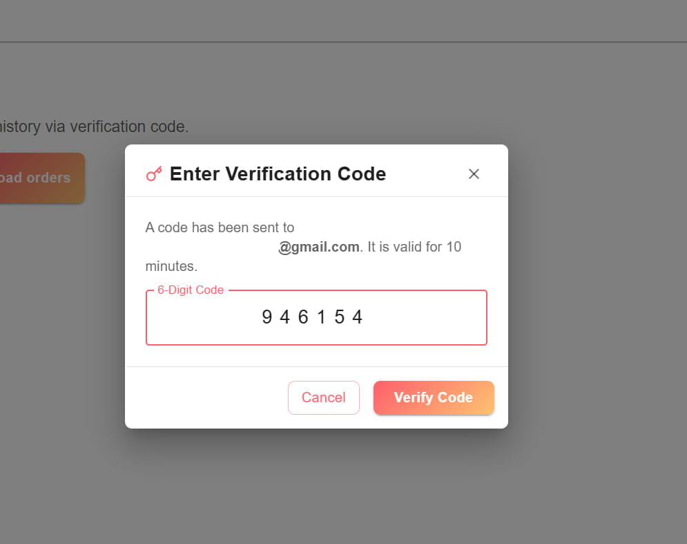
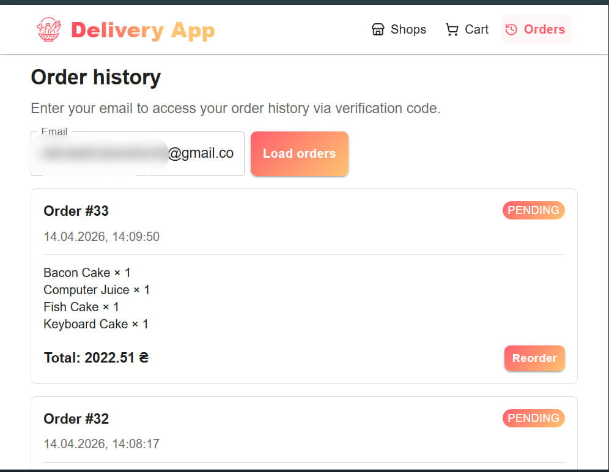

# 🍨 _Food Delivery App_ 

_A modern, full-stack food ordering and delivery platform built with a focus on performance, scalability, and seamless user experience._

*This project is implemented as a **Monorepo**, containing both the frontend and backend services in a single repository for easier development and deployment.*

---

<div style="display: flex; flex-wrap: wrap; gap: 15px;">
  
  
  
  
  
  
  
  
  
  
</div>

---

## Key Features

- **Infinite Scroll & Pagination:** Optimized product loading in batches to ensure high performance and smooth UI.
- **Monorepo Architecture:** Clear separation of concerns between Client and Server.
- **Dynamic Product Filtering:** Filter items by category (Main Dishes, Desserts, Drinks) and shop rating.
- **Real-time Order History:** Search orders by email and phone with the ability to **Reorder** previous items.
- **Responsive Design:** Fully adapted for Desktop, Tablet, and Mobile devices.
- **Database Seeding:** Automated generation of 330+ realistic products and reviews using Faker/loremflickr.
- **Swager Documentation:** Implement automatic generation of API documentation to simplify and streamline testing.

---

##  Technology Stack

### Frontend (Client)

* **React 19** & **Vite** : Fast UI rendering and modern build tool.
* **Redux Toolkit & RTK Query** : Advanced state management and efficient API data fetching/caching.
* **Material UI (MUI)** : Component library for a polished, professional look.
* **React Hook Form & Yup** : Robust form handling and client-side validation.
* **TypeScript** : For type-safe and reliable code.

### Backend (Server)

* **NestJS** : Progressive Node.js framework for scalable server-side applications.
* **PostgreSQL** : Powerful relational database for reliable data storage.
* **Prisma ORM** : Type-safe database client and migration tool.
* **Swagger API** : Automated API documentation.
* **Faker.js** : For generating high-quality seed data.
* **Resend Email Service**: For sending verification code.

---

### Short Video:

* **User Email Verification:** Ensures secure access by verifying users via their email addresses.

[🔗 Delivery App](https://drive.google.com/file/d/1Fv7woamqFwHWCqBkcKaFUadIosNtVarY/view?usp=sharing)


## 🛡 Security, Authorization & Data Protection

- Implementation of a robust security layer to protect user data.
- A verification system has been integrated to ensure privacy and prevent unauthorized access.
- User order history is strictly protected and accessible only to the verified owner of the email address.

### 🛠 Technology Stack for Security

&#8900; **JWT (JSON Web Tokens)**

 -  Used for secure, stateless authentication. After verification of the one-time code, a signed token is issued for subsequent authorized requests.

&#8900; **Passport.js & JWT Strategy**

- Configuration of a dedicated authentication strategy to decode and validate tokens, ensuring user identity verification for every backend request.

&#8900;**NestJS Guards**

 - Implementation of security Guards to protect specific endpoints. The Order History route is private and accessible only with a valid JWT.

&#8900; **Resend Email Service**

- Integration of a transactional email provider for the delivery of 6-digit verification codes (OTP) to the user's inbox.

### 🛡 Personal Data Protection Logic

- The system is designed to prevent unauthorized access to private data (order history, personal details) even if a third party knows the user's email.
- Access is granted only after successful verification of a dynamic code, which triggers the generation of a secure session token.

###  **Important Technical Note on Resend Integration**

> &#8900; **Note on Testing Environment**
> A verified custom domain is required for production use of the **Resend** service.
 >- For demonstration purposes, the project operates in **Testing Mode**.
> 
> - In this mode, emails can only be sent to a list of **"Allowed Recipients"** (up to 10 addresses).
>- To test the email functionality, the recipient's email must be manually added and confirmed in the Resend dashboard.
##  Installation & Setup

### 1. Clone the repository
```bash
git clone <your-repository-url>
cd delivery-app

# Install server dependencies
cd apps/server
npm install

# Install web dependencies
cd ../web
npm install